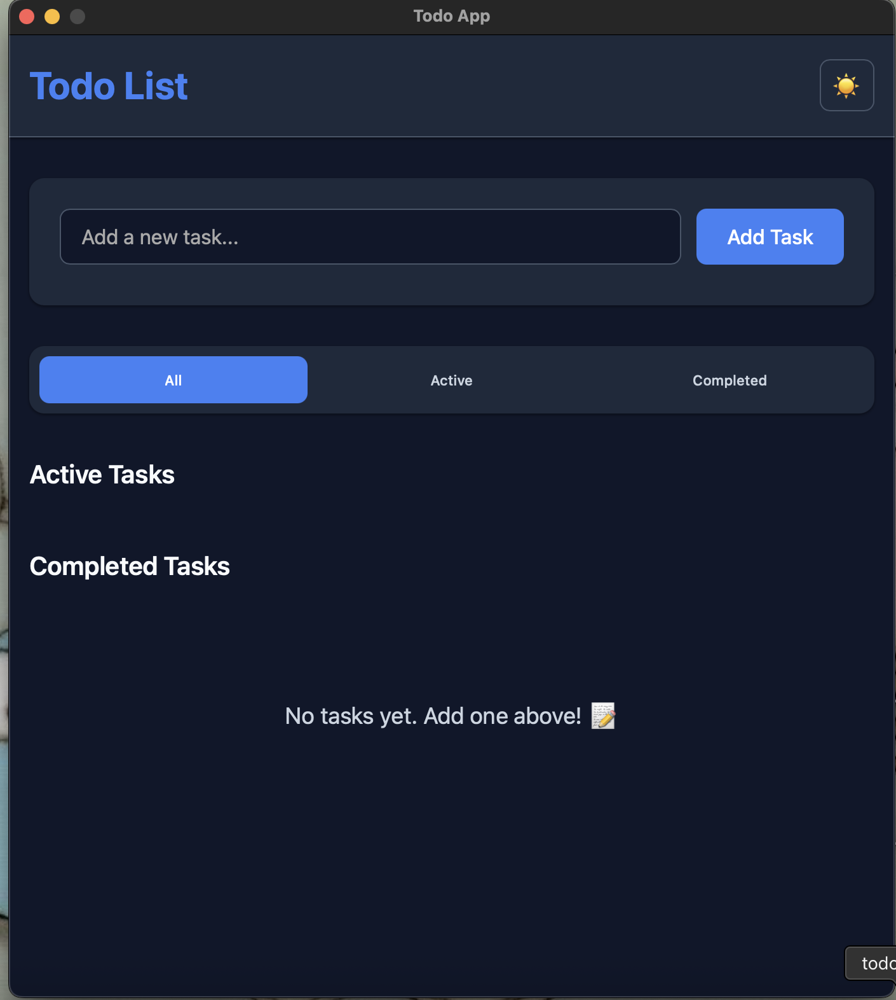
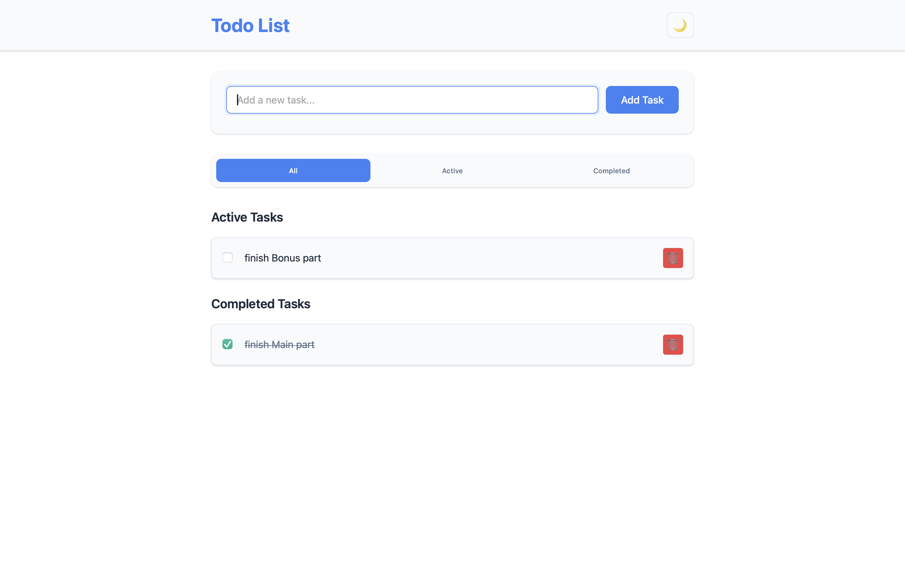
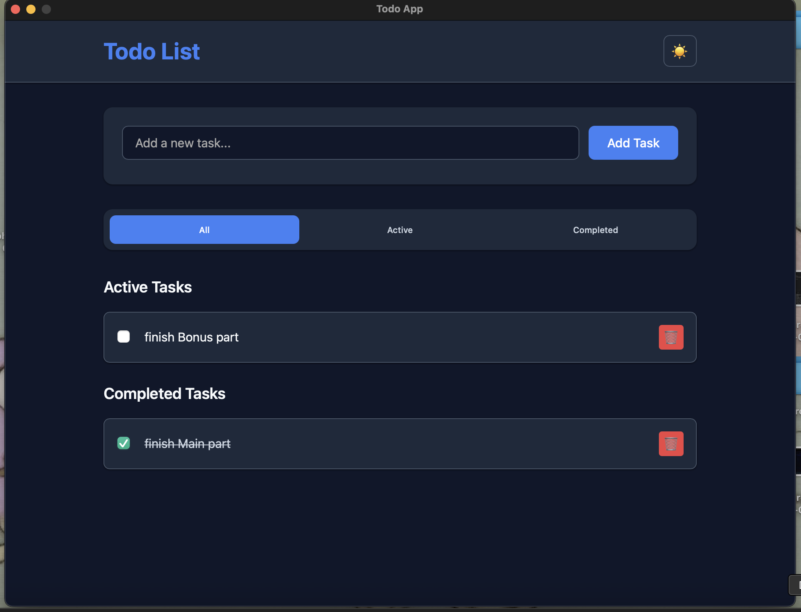
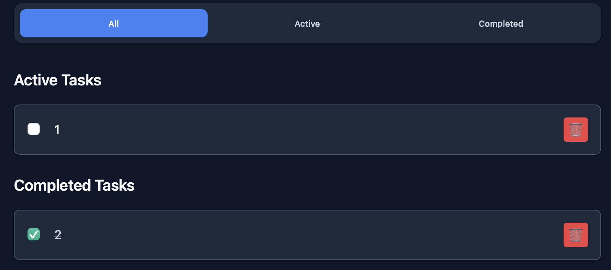
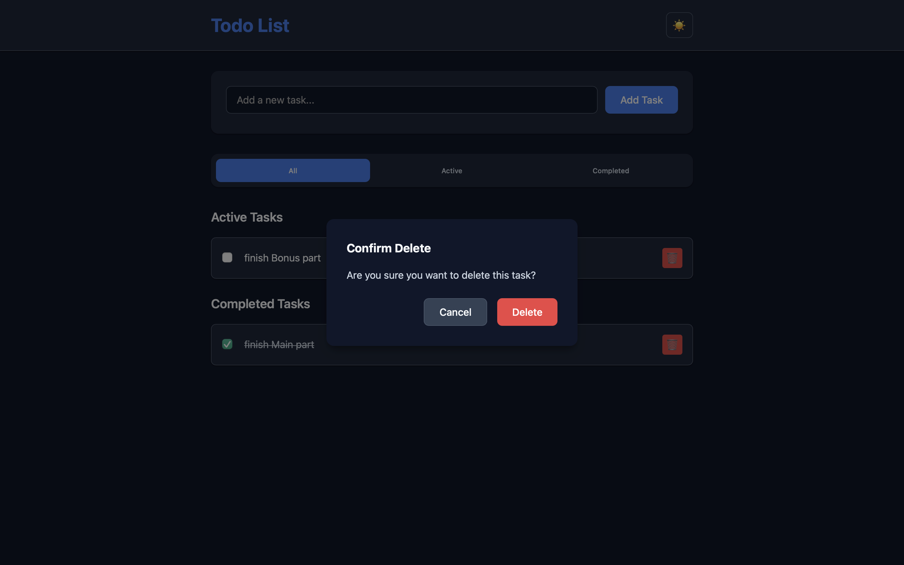
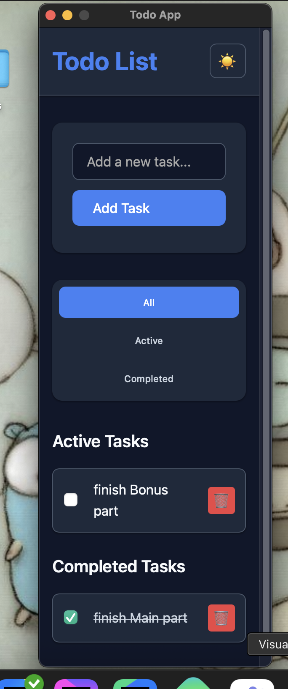

# Todo List Desktop Application

Кросс-платформенное desktop приложение для управления списком задач, разработанное с использованием **Wails v2**, **Go** и **JavaScript**. Приложение поддерживает полный функционал CRUD операций с задачами, фильтрацию, сортировку и сохранение данных в PostgreSQL.



## ✅ Checklist выполненных требований

### **1. Интерфейс пользователя (25 баллов) - 25/25 ✅**

**Основная часть (15 баллов) - 15/15 ✅**
- ✅ Создать интерфейс с текстовым полем для ввода новой задачи
- ✅ Добавить кнопку для добавления задачи в список
- ✅ Отображать список всех задач на экране
- ✅ Использовать CSS для стилизации интерфейса
- ✅ Использовать значки или цвета для обозначения выполненных и невыполненных задач

**Бонусная часть (10 баллов) - 10/10 ✅**
- ✅ Адаптивная верстка (корректно работает при изменении размера окна)
- ✅ Возможность переключения светлой/тёмной темы

### **2. Добавление задач (20 баллов) - 10/20 ⚠️**

**Основная часть (10 баллов) - 10/10 ✅**
- ✅ Реализовать функционал добавления новой задачи в список
- ✅ Валидация ввода (проверка на пустой ввод)

**Бонусная часть (10 баллов) - 0/10 ❌**
- ❌ Возможность добавлять задачи с датой и временем выполнения (не реализовано)
- ❌ Установка приоритета задачи (низкий, средний, высокий) (не реализовано)

### **3. Удаление задач (15 баллов) - 15/15 ✅**

**Основная часть (5 баллов) - 5/5 ✅**
- ✅ Реализовать возможность удаления задач из списка

**Бонусная часть (10 баллов) - 10/10 ✅**
- ✅ Добавить подтверждение удаления задачи (модальное окно)

### **4. Управление выполнением задач (30 баллов) - 30/30 ✅**

**Основная часть (10 баллов) - 10/10 ✅**
- ✅ Реализовать возможность отметки задачи как выполненной
- ✅ Зачеркивание текста выполненных задач

**Бонусная часть (20 баллов) - 20/20 ✅**
- ✅ Перемещение выполненных задач в отдельный раздел «Выполненные задачи»
- ✅ Возможность отмены отметки выполнения задачи (возврат в «Активные задачи»)

### **5. Сохранение состояния (50 баллов) - 50/50 ✅**

**Основная часть (20 баллов) - 20/20 ✅**
- ✅ Сохранение состояния задач при закрытии приложения
- ✅ Загрузка состояния задач при запуске приложения

**Бонусная часть (30 баллов) - 30/30 ✅**
- ✅ Использование PostgreSQL для хранения задач
- ✅ Создать и использовать repo → service → usecase слои для работы с данными

### **6. Фильтрация и сортировка задач (20 баллов) - 10/20 ⚠️**

**Основная часть (10 баллов) - 10/10 ✅**
- ✅ Фильтрация задач по статусу (все / активные / выполненные)
- ✅ Сортировка по дате добавления

**Бонусная часть (10 баллов) - 0/10 ❌**
- ❌ Сортировка по приоритету (не реализовано, так как нет приоритетности)
- ❌ Фильтрация по дате (сегодня / на неделю / просроченные) (не реализовано, так как нет дат выполнения)

---

## 📊 Итоговый результат

**Базовые пункты:** 60/60 баллов ✅  
**Бонусные пункты:** 70/100 баллов ⚠️  
**Общий результат:** **130/160 баллов**

### Реализованные дополнительные функции:
- 🎨 **Современный UI/UX** - красивый интерфейс с анимациями
- 🌙 **Темная/светлая тема** - переключение тем с сохранением настроек
- 📱 **Адаптивная верстка** - корректное отображение на разных размерах экрана
- 🗑️ **Модальное подтверждение** - защита от случайного удаления
- 📋 **Разделение секций** - отдельные разделы для активных и выполненных задач
- 🔄 **Отмена выполнения** - возможность вернуть задачу в активные
- 🗄️ **PostgreSQL + Clean Architecture** - профессиональная архитектура
- ⚡ **Обработка ошибок** - корректная обработка и отображение ошибок

## 🏗️ Архитектура

Приложение построено по принципам **Clean Architecture**:

```
internal/
├── domain/          # Модели и интерфейсы
├── repository/      # Работа с PostgreSQL (GORM)
├── service/         # Бизнес-логика и валидация
├── usecase/         # Слой приложения
├── handler/         # Wails handlers для frontend
└── config/          # Конфигурация приложения
```

### Технологический стек

**Backend:**
- **Go 1.21+** - основной язык backend
- **Wails v2** - фреймворк для desktop приложений
- **GORM** - ORM для работы с PostgreSQL
- **PostgreSQL** - основная база данных

**Frontend:**
- **Vanilla JavaScript** - без дополнительных фреймворков
- **CSS3** - современная стилизация с переменными и анимациями
- **Vite** - сборщик и dev-сервер

## 📋 Требования

- **Go 1.21+**
- **Node.js 16+**
- **PostgreSQL 12+**
- **Wails CLI v2**

### Установка зависимостей

```bash
# Установка Wails CLI
go install github.com/wailsapp/wails/v2/cmd/wails@latest

# Проверка окружения
wails doctor
```

## 🚀 Установка и запуск

### 1. Клонирование проекта

```bash
git clone https://github.com/yerakairzhan/todo-app-wails
cd todo-app
```

### 2. Настройка PostgreSQL

**Вариант 1: Локальная установка**
```sql
-- Создание базы данных и пользователя
CREATE DATABASE todoapp;
CREATE USER todouser WITH PASSWORD 'todopass';
GRANT ALL PRIVILEGES ON DATABASE todoapp TO todouser;
```

**Вариант 2: Docker**
```bash
docker run --name postgres-todo \
  -e POSTGRES_DB=todoapp \
  -e POSTGRES_USER=todouser \
  -e POSTGRES_PASSWORD=todopass \
  -p 5432:5432 \
  -d postgres:15
```

### 3. Конфигурация

Создайте файл `.env` в корне проекта:

```env
DB_HOST=localhost
DB_PORT=5432
DB_USER=todouser
DB_PASSWORD=todopass
DB_NAME=todoapp
DB_SSLMODE=disable
```

### 4. Установка зависимостей

```bash
# Go модули
go mod tidy

# Frontend зависимости
cd frontend && npm install && cd ..
```

### 5. Запуск приложения

**Режим разработки:**
```bash
wails dev
```

**Сборка для продакшена:**
```bash
wails build
```

Готовое приложение будет в папке `build/bin/`

## 📖 Использование

### Основные операции

1. **Добавление задачи** - введите текст в поле ввода и нажмите "Add Task"
2. **Отметка выполнения** - кликните на чекбокс рядом с задачей
3. **Удаление задачи** - нажмите кнопку 🗑️ и подтвердите в модальном окне
4. **Фильтрация** - используйте вкладки "All", "Active", "Completed"
5. **Смена темы** - нажмите кнопку 🌙/☀️ в шапке

### Структура данных

```go
type Task struct {
    ID          uint      `json:"id"`
    Title       string    `json:"title"`
    IsCompleted bool      `json:"is_completed"`
    CreatedAt   time.Time `json:"created_at"`
}
```

## 🖼️ Скриншоты

### Светлая тема


### Темная тема


### Фильтрация задач


### Модальное окно удаления


### Адаптивная верстка


## 📹 Демонстрация

[Ссылка на видеозапись работы приложения](screenshots/demo-video.mp4)

**Что показано в демо:**
- Добавление новых задач с валидацией
- Переключение статуса выполнения
- Удаление задач с подтверждением
- Фильтрация по статусу
- Смена темы оформления
- Адаптивность интерфейса
- Сохранение данных между перезапусками

## 🧪 Тестирование

### Ручное тестирование

1. **Создание задач:**
   - ✅ Добавление обычной задачи
   - ✅ Валидация пустого ввода
   - ✅ Валидация длинного текста (>255 символов)

2. **Управление задачами:**
   - ✅ Отметка как выполненной
   - ✅ Отмена выполнения
   - ✅ Удаление с подтверждением

3. **Фильтрация:**
   - ✅ Показ всех задач
   - ✅ Только активные задачи
   - ✅ Только выполненные задачи

4. **Интерфейс:**
   - ✅ Смена темы
   - ✅ Адаптивность
   - ✅ Анимации

5. **Данные:**
   - ✅ Сохранение в PostgreSQL
   - ✅ Загрузка при запуске

## 🛠️ Разработка

### Структура проекта

```
todo-app/
├── cmd/                    # Точки входа
├── internal/               # Внутренняя логика
│   ├── domain/            # Доменные модели
│   ├── repository/        # Слой данных
│   ├── service/           # Бизнес-логика
│   ├── usecase/           # Прикладная логика
│   ├── handler/           # Wails handlers
│   └── config/            # Конфигурация
├── frontend/              # Frontend код
│   ├── src/               # JavaScript и CSS
│   ├── wailsjs/           # Сгенерированные bindings
│   └── index.html         # Главная страница
├── screenshots/           # Скриншоты для README
├── .env                   # Переменные окружения
├── wails.json            # Конфигурация Wails
└── README.md             # Документация
```

### База данных

Таблица создается автоматически при первом запуске через GORM AutoMigrate:

```sql
CREATE TABLE tasks (
    id SERIAL PRIMARY KEY,
    title VARCHAR(255) NOT NULL,
    is_completed BOOLEAN DEFAULT FALSE,
    created_at TIMESTAMP DEFAULT CURRENT_TIMESTAMP
);
```

## 📝 Возможные улучшения

Функции, которые можно добавить в будущем:

- 📅 **Даты и время** - добавление сроков выполнения задач
- 🏷️ **Приоритеты** - система приоритетов (низкий, средний, высокий)
- 🔍 **Поиск** - полнотекстовый поиск по задачам
- 📊 **Статистика** - аналитика продуктивности
- 🔔 **Уведомления** - напоминания о задачах

## 👨‍💻 Автор

**Yerassyl Kaiyrzhan**
- Email: erakairzhan@gmail.com
- Telegram: @erakairzhan
